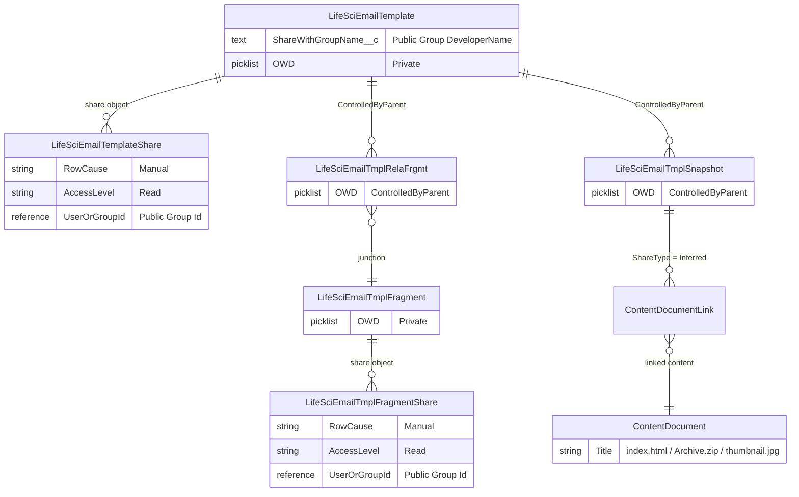

# LSC Email Template Sharing by Public Group

Share Life Sciences Cloud (LSC) email templates with users via **Public Groups** instead of (or in addition to) territory-based sharing.

## Problem

Out of the box, LSC only supports sharing email templates by assigning them to **territories** (via Admin Console > Email > Email Templates). Sharing rules are an alternative, but Salesforce limits the number of sharing rules per object. This solution uses a trigger-based approach that scales without hitting sharing rule limits.

## Solution Overview

A custom field (`ShareWithGroupName__c`) on `LifeSciEmailTemplate` holds a **Public Group DeveloperName** (the API/Group Name, e.g., `Product_Launch`). An Apex trigger resolves the DeveloperName to a Group ID at runtime and automatically creates/manages `LifeSciEmailTemplateShare` and `LifeSciEmailTmplFragmentShare` records.

### Data Model



**Objects that need explicit sharing (OWD = Private):**
| Object | Share Object | Managed by trigger? |
|--------|-------------|-------------------|
| `LifeSciEmailTemplate` | `LifeSciEmailTemplateShare` | Yes |
| `LifeSciEmailTmplFragment` | `LifeSciEmailTmplFragmentShare` | Yes |

**Objects that inherit access automatically (ControlledByParent):**
| Object | Parent |
|--------|--------|
| `LifeSciEmailTmplRelaFrgmt` | `LifeSciEmailTemplate` |
| `LifeSciEmailTmplSnapshot` | `LifeSciEmailTemplate` |

### Components

| Component | Type | Description |
|-----------|------|-------------|
| `ShareWithGroupName__c` | Custom Field | Text(255) on `LifeSciEmailTemplate` — holds Public Group DeveloperName |
| `DEMO_EmailTmplGroupSharing` | Apex Trigger | Fires before/after insert, update, delete |
| `DEMO_EmailTmplGroupSharingHandler` | Apex Class | Handler with group name lookup and sharing logic |
| `DEMO_EmailTmplGroupSharingTest` | Apex Test | 7 test methods, 97%+ coverage |

## How It Works

| Event | Behavior |
|-------|----------|
| **Insert** with group DeveloperName populated | Resolves to Group ID, creates template share + fragment shares |
| **Update** group DeveloperName changed | Removes old shares, resolves new name, creates new shares |
| **Update** group DeveloperName cleared | Removes all Manual shares |
| **Delete** template | Fragment shares cleaned up (template shares cascade-delete) |
| **Invalid group name** | Silently skipped (no shares created, no error) |

The trigger uses `before delete` to cache fragment IDs before the junction records (`LifeSciEmailTmplRelaFrgmt`) cascade-delete, then cleans up fragment shares in `after delete`.

Group resolution queries `Group WHERE DeveloperName = :name AND Type = 'Regular'`, so only Public Groups are matched (not roles, territories, or queues). The DeveloperName is more stable than the Label since it doesn't change when an admin renames the group in the UI.

## Setup

### Prerequisites

- LSC org with API version 65.0+ (objects like `LifeSciEmailTemplate` require this)
- Field Email module enabled

### Deploy

<a href="https://githubsfdeploy.herokuapp.com?owner=afls-ideas&repo=Email_Template_Sharing">
  
</a>

Or deploy manually via CLI:

```bash
sf project deploy start --source-dir force-app --target-org <your-org-alias>
```

### Grant Field-Level Security for `ShareWithGroupName__c`

The deployment creates the custom field on `LifeSciEmailTemplate`, but does **not** grant FLS (field-level security) to any profile or permission set — every org's security model is different.

After deploying, grant **Read** (and optionally **Edit**) access on `LifeSciEmailTemplate.ShareWithGroupName__c` to the profiles or permission sets used by admins who will populate the field:

- **Via Permission Set** — Setup > Permission Sets > *your permission set* > Object Settings > Life Sciences Email Templates > Edit > enable `Share With Group Name`
- **Via Profile** — Setup > Profiles > *your profile* > Object Settings > Life Sciences Email Templates > Edit > enable `Share With Group Name`

Without this step the field will not be visible or editable, and the trigger will have no effect.

### Configure

1. **Create a Public Group** (Setup > Users > Public Groups) with the users who should receive template access.

2. **Set the group DeveloperName on a template** — either via:
   - Direct field edit on the `LifeSciEmailTemplate` record (e.g., type `Product_Launch`)
   - Data Loader / Workbench for bulk updates
   - A custom UI (e.g., screen flow or LWC)

   The value must match the Group's **Group Name** (DeveloperName) exactly — this is the API name shown in Setup, not the Label.

3. **Verify** — query the share records:
   ```sql
   SELECT Id, ParentId, UserOrGroupId, AccessLevel, RowCause
   FROM LifeSciEmailTemplateShare
   WHERE RowCause = 'Manual'
   ```

### Run Tests

```bash
sf apex test run --class-names DEMO_EmailTmplGroupSharingTest --target-org <your-org-alias> --synchronous --code-coverage
```

## Coexistence with Territory Sharing

This trigger creates shares with `RowCause = 'Manual'`. LSC's built-in territory sharing uses `RowCause = 'LSC4CEAutoShare'`. Both can coexist — Salesforce grants the most permissive access level when multiple share records exist for the same user.

## Limitations

- **Single group per template** — the field holds one DeveloperName. To share with multiple groups, extend the solution to use a related list or multi-value field.
- **DeveloperName must be exact** — the value must match the group's DeveloperName precisely. Unlike labels, DeveloperNames cannot be changed after creation, so this is stable.
- **Fragment share cleanup on delete** — removes all Manual-cause fragment shares for affected fragments. If the same fragment is shared via multiple templates to different groups, clearing one template's group may remove shares needed by another. For production use, consider reference-counting fragment shares.

## Disclaimer

This project is provided **AS IS** with no warranty or guarantee of any kind, express or implied. It is intended as a reference implementation and starting point — not a production-ready solution. You are solely responsible for testing, validating, and adapting this code to your org's requirements before deploying to any environment with real users or data. Use at your own risk.
